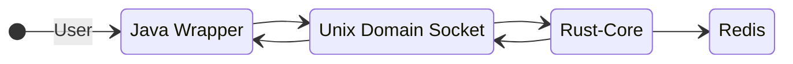
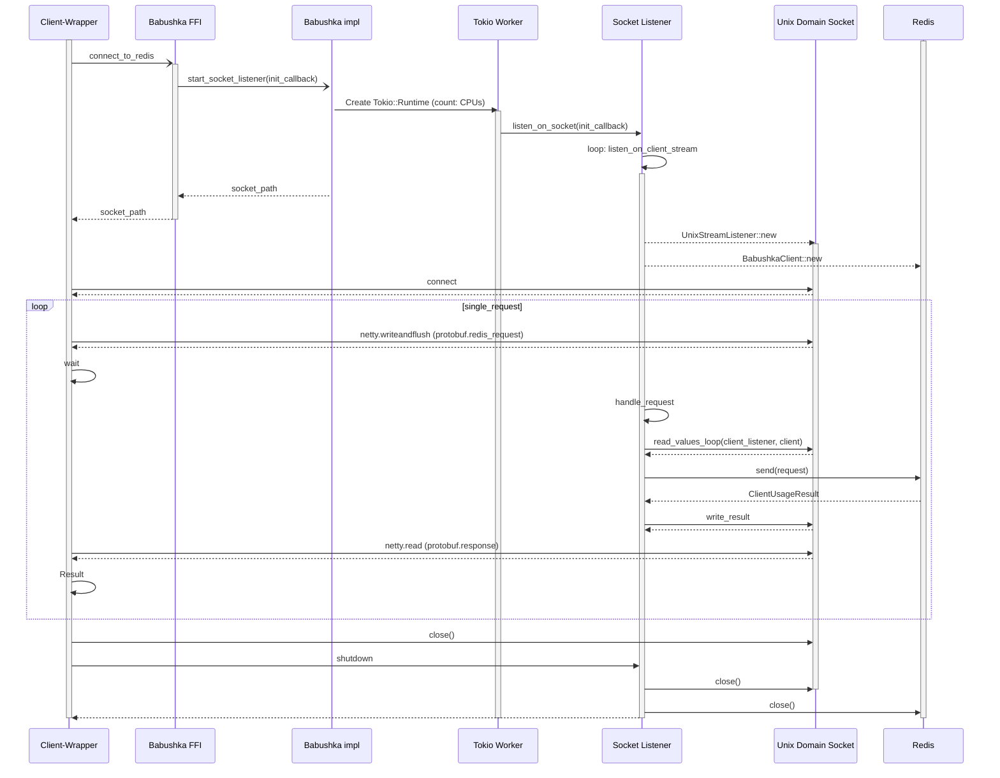
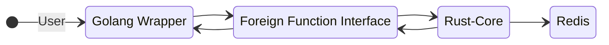
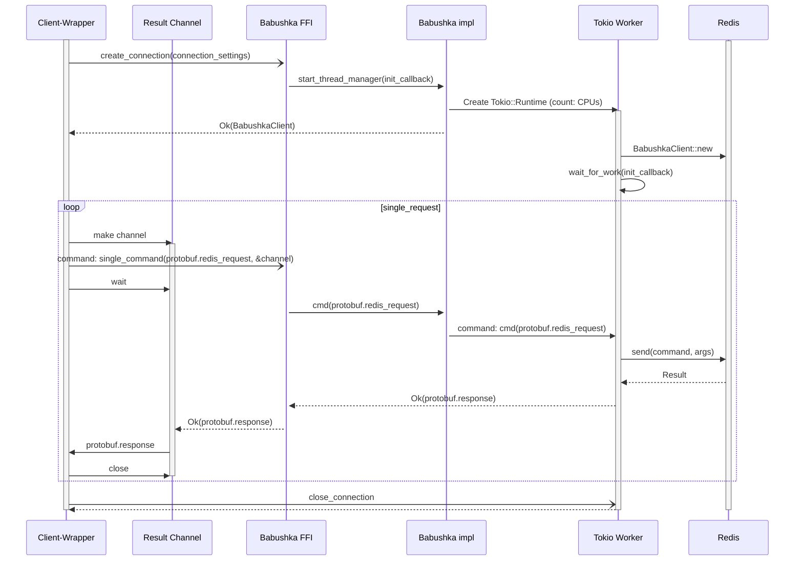

# Babushka Core Wrappers

## Summary

The Babushka client allows Redis users to connect to Redis using a variety of commands through a thin-client optimized for 
various languages.  The client uses a performant core to establish and manage connections and communicate with Redis. The thin-client
wrapper talks to the core using an FFI (foreign function interface) to Rust. 

The following document discusses two primary communication protocol architectures for wrapping the Babushka clients. Specifically, 
it details how Java-Babushka and Go-Babushka each use a different protocol and describes the advantages of each language-specific approach.

# Unix Domain Socket Manager Connector

## High-Level Design 

**Summary**: The Babushka "UDS" solution uses a socket listener to manage rust-to-wrapper worker threads, and unix domain sockets 
to deliver command requests between the wrapper and redis-client threads.  This works well because we allow the unix sockets to pass messages and manage threads
through the OS, and unix sockets are very performant. This results in simple/fast communication.  The risk to avoid is that 
unix sockets can become a bottleneck for data-intensive commands, and the library can spend too much time waiting on I/O
blocking operations. 

## Decision to use UDS Sockets for a Java-Babushka Wrapper

The decision to use Unix Domain Sockets (UDS) to manage the Java-wrapper to Babushka Redis-client communication was two-fold, vs a raw-FFI solution:  
1. Java contains an efficient socket protocol library (netty.io) that provides a highly configurable environment to manage sockets.
2. Java objects serialization/de-serialization is an expensive operation, and a performing multiple io operations between raw-ffi calls would be inefficient.

### Decision Log

| Protocol                                     | Details                                                 | Pros                        | Cons                                               |
|----------------------------------------------|---------------------------------------------------------|-----------------------------|----------------------------------------------------|
| Unix Domain Sockets (jni/netty)              | JNI to submit commands; netty.io for message passing    | netty.io standard lib;      | complex configuration; limited by socket interface |
| Raw-FFI (JNA, uniffi-rs, j4rs, interoptopus) | JNA to submit commands; protobuf for message processing | reusable in other languages | Slow performance and uses JNI under the hood;      |
| Panama/jextract                              | Performance similar to a raw-ffi using JNI              | modern                      | lacks early Java support (JDK 18+); prototype      |

### Sequence Diagram

### Elements
* **Wrapper**: Our Babushka wrapper that exposes a client API (java, python, node, etc)
* **Babushka FFI**: Foreign Function Interface definitions from our wrapper to our Rust Babushka-Core
* **Babushka impl**: public interface layer and thread manager
* **Tokio Worker**: Tokio worker threads (number of CPUs)
* **SocketListener**: listens for work from the Socket, and handles commands
* **Unix Domain Socket**: Unix Domain Socket to handle communication
* **Redis**: Our data store

## Wrapper-to-Core Connector with raw-FFI calls

**Summary**: Foreign Function Interface (FFI) calls are simple to implement, cross-language calls.  The setup between Golang and the Rust-core
is fairly simple using the well-supported CGO library.  While sending language calls is easy, setting it up in an async manner
requires that we handle async callbacks. Golang has a simple, light-weight solution to that, using goroutines and channels, 
to pass callbacks and execution between the languages. 

## Decision to use Raw-FFI calls directly to Rust-Core for Golang Wrapper

### Decision Log

The decision to use raw FFI request from Golang to Rust-core was straight forward:
1. Golang contains goroutines as an alternative, lightweight, and performant solution serves as an obvious solution to pass request, even at scale. 

| Protocol                 | Details | Pros                                                   | Cons                                 |
|--------------------------|---------|--------------------------------------------------------|--------------------------------------|
| Unix Domain Sockets      |         | UDS performance; consistent protocol between languages | complex configuration                |
| Raw-FFI (CGO/goroutines) |         | simplified and light-weight interface                  | separate management for each request |

## Sequence Diagram - Raw-FFI Client

**Summary**: If we make direct calls through FFI from our Wrapper to Rust, we can initiate commands to Redis.  This allows us
to make on-demand calls directly to Rust-core solution. Since the calls are async, we need to manage and populate a callback
object with the response and a payload.  

We will need to avoid busy waits while waiting on the async response. The wrapper and Rust-core languages independently track
threads.  On the Rust side, they use a Tokio runtime to manage threads. When the Rust-core is complete, and returning a Response,
we can use the Callback object to re-awake the wrapper thread manager and continue work.

Go routines have a performant solution using light-weight go-routines and channels.  Instead of busy-waiting, we awaken by 
pushing goroutines to the result channel once the Tokio threads send back a callback.  

### Sequence Diagram

### Elements
* **Client-Wrapper**: Our Babushka wrapper that exposes a client API (Go, etc)
* **Result Channel**: Goroutine channel on the Babushka Wrapper 
* **Babushka FFI**: Foreign Function Interface definitions from our wrapper to our Rust Babushka-Core
* **Babushka impl**: public interface layer and thread manager
* **Tokio Worker**: Tokio worker threads (number of CPUs)
* **Redis**: Our data store