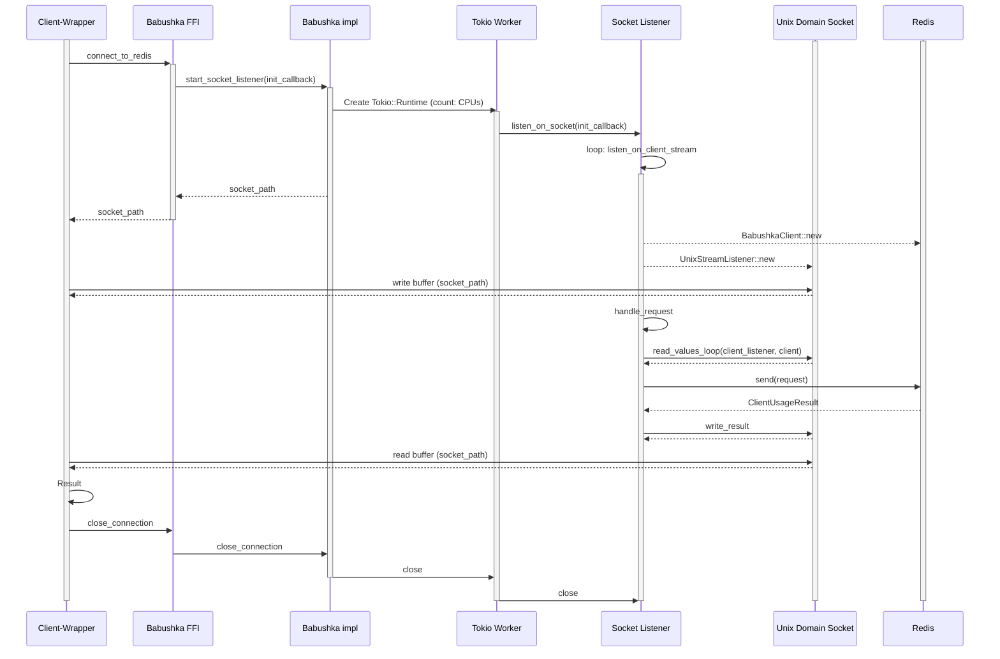

# Babushka Socket Listener

## Sequence Diagram - Unix Domain Socket Manager

**Summary**: The Babushka "UDS" solution uses a socket manager to redis-client worker threads, and UDS to manage the communication
between the wrapper and redis-client threads.  This works well because we allow the socket to manage the communication. This 
results in simple/fast communication.  But the worry is that the unix sockets can become a bottleneck for data-intensive communication; 
ie read/write buffer operations become the bottleneck.  

_Observation_: We noticed that we are creating a fixed number of Babushka/Redis client connections based on the number of CPUs available. 
It would be better to configure this thread count, or default it to the number of CPUs available.  

## Elements
* **Wrapper**: Our Babushka wrapper that exposes a client API (java, python, node, etc)
* **Babushka FFI**: Foreign Function Interface definitions from our wrapper to our Rust Babushka-Core
* **Babushka impl**: public interface layer and thread manager
* **Tokio Worker**: Tokio worker threads (number of CPUs) 
* **SocketListener**: listens for work from the Socket, and handles commands
* **Unix Domain Socket**: Unix Domain Socket to handle communication
* **Redis**: Our data store

## (Current) Raw-FFI Benchmark Test

**Summary**: We copied the C# benchmarking implementation, and discovered that it wasn't using the Babushka/Redis client 
at all, but instead spawning a single worker thread to connect to Redis using a general Rust Redis client.

## Sequence Diagram - Managed Raw-FFI Client

**Summary**: Following the socket listener/manager solution, we can create a [event manager](https://en.wikipedia.org/wiki/Reactor_pattern)
on the Rust side that will spawn worker threads available to execute event commands on-demand. FFI calls will petition the 
worker thread manager for work request. 

_Expectation_: According to Shachar, it is our understanding that having a Tokio thead manager on the Rust side, and an event
manager on the Wrapper-side will create a lot of busy-waiting between the two thread managers. 

_Observation_: Go routines seems to have a decent solution using channels.  Instead of waiting, we can close the threads
on the wrapper since, and (awaken) push the threads back to the channel once the Tokio threads are completed. 

